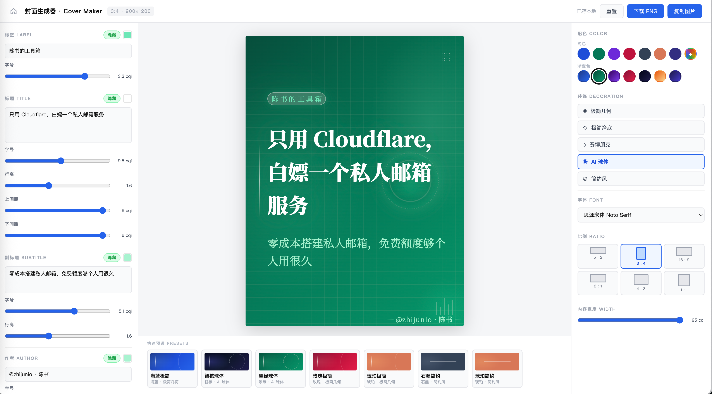
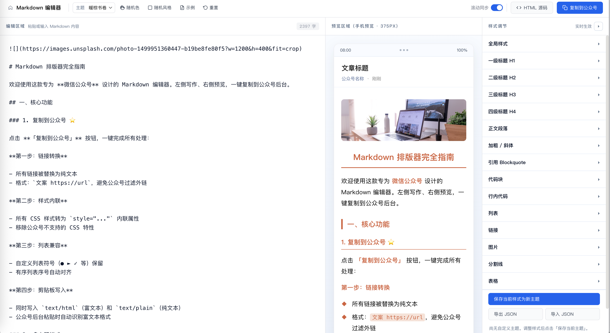

# Article Tools

一套本地可用的在线工具集（封面图、Markdown 排版器、二维码等），可部署在 GitHub Pages 使用。

**在线预览：** https://zhijunio.github.io/article-tools/

## 工具列表

### 封面生成

生成封面图，支持配色、比例、装饰、字体与本地保存参数。

### Markdown 排版器

**微信公众号** Markdown 编辑器。支持图片压缩/本地存储、代码高亮、主题定制。

### 公众号排版工作室 

公众号文章排版。**12 种专业风格 + 5 种图片角色 + 完整版式元素**，扩展了 Markdown 语法。

### 二维码

生成与解析二维码

## 使用方式

直接用浏览器打开对应 HTML 即可；第三方库从 CDN 拉取，需联网。

## 参考

- https://github.com/eternityspring/article-tools
- https://github.com/alchaincyf/huasheng_editor
- https://gordensun.github.io/WX/

## License

[MIT](LICENSE)
